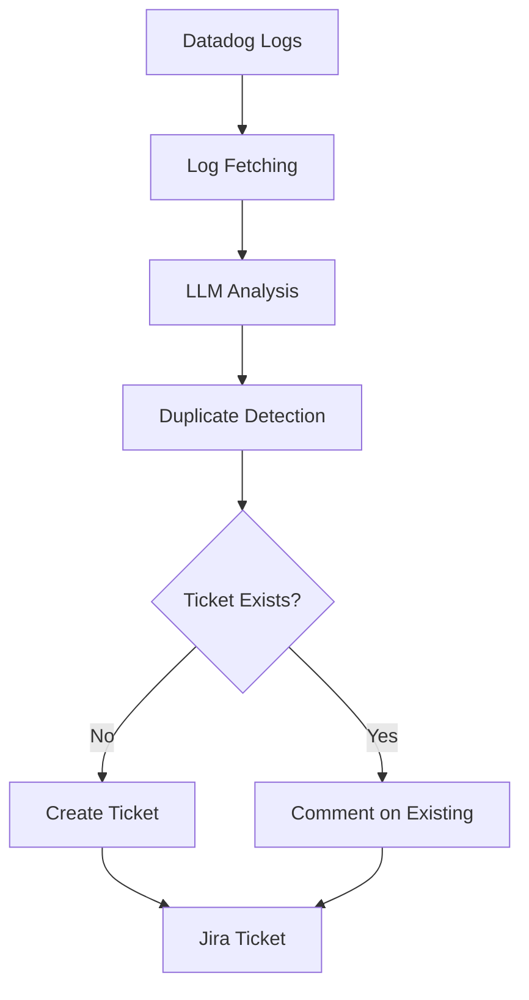

# Developer Guide - Dogcatcher Agent

Welcome to the **Dogcatcher Agent** development environment! This guide will help you set up, understand, and contribute to the project.

## 📋 Table of Contents

- [Prerequisites](#prerequisites)
- [Quick Start](#quick-start)
- [Project Architecture](#project-architecture)
- [Configuration](#configuration)
- [Development Workflow](#development-workflow)
- [Testing](#testing)
- [Performance Monitoring](#performance-monitoring)
- [Troubleshooting](#troubleshooting)
- [Contributing](#contributing)
- [FAQ](#faq)
- [LangGraph Studio](#langgraph-studio)

## 🛠️ Prerequisites

### Required Software

- **Python 3.11+** - [Download](https://www.python.org/downloads/)
- **Git** - [Download](https://git-scm.com/downloads)
- **Docker** (optional) - [Download](https://www.docker.com/get-started)

### Required Accounts & API Keys

- **OpenAI API Key** - [Get API Key](https://platform.openai.com/api-keys)
- **Datadog Account** - [Sign Up](https://www.datadoghq.com/)
- **Jira Instance** - [Atlassian](https://www.atlassian.com/software/jira)

### Development Tools (Recommended)

- **VS Code** with Python extension
- **pytest** for testing
- **black** for code formatting
- **mypy** for type checking

## 🚀 Quick Start

### 1. Clone and Setup

```bash
# Clone the repository
git clone https://github.com/organization/dogcatcher-agent.git
cd dogcatcher-agent

# Create virtual environment
python -m venv venv
source venv/bin/activate  # On Windows: venv\Scripts\activate

# Install dependencies
pip install -r requirements.txt
```

### 2. Environment Configuration

```bash
# Copy example environment file
cp .env.example .env

# Edit with your API keys and settings
nano .env  # or use your preferred editor
```

### 3. Run Your First Test

```bash
# Run in dry-run mode (safe for testing)
python main.py --dry-run

# Check if everything works
python run_tests.py
```

## 🏗️ Project Architecture

### High-Level Overview

```
dogcatcher-agent/
├── main.py                 # Entry point and CLI
├── agent/                  # Core agent logic
│   ├── config.py          # Configuration management
│   ├── datadog.py         # Datadog API client
│   ├── graph.py           # LangGraph pipeline
│   ├── performance.py     # Performance optimizations
│   ├── jira/              # Jira integration
│   │   ├── client.py      # HTTP client
│   │   ├── match.py       # Duplicate detection
│   │   └── utils.py       # Utilities
│   ├── nodes/             # Processing nodes
│   │   ├── analysis.py    # LLM analysis
│   │   ├── audit.py       # Audit logging
│   │   ├── fetch.py       # Data fetching
│   │   └── ticket.py      # Ticket creation
│   └── utils/             # Shared utilities
│       └── logger.py      # Logging utilities
├── tests/                 # Test suite
├── docs/                  # Documentation
└── patchy/                # Self-healing PR bot
```

### Data Flow



### Key Components

#### 1. **Configuration System** (`agent/config.py`)
- Pydantic-based configuration with validation
- Environment variable management
- Type safety and range validation
- Performance optimization settings

#### 2. **LangGraph Pipeline** (`agent/graph.py`)
- Stateful multi-step processing
- Error handling and recovery
- Log processing workflow

#### 3. **Duplicate Detection** (`agent/jira/match.py`)
- Multi-strategy duplicate detection
- Similarity scoring with configurable thresholds
- Performance caching for efficiency

#### 4. **Performance System** (`agent/performance.py`)
- Intelligent caching with TTL
- Performance metrics and monitoring
- Dynamic parameter optimization

## ⚙️ Configuration

### Environment Variables

Create a `.env` file with the following variables:

```bash
# OpenAI Configuration
OPENAI_API_KEY=sk-your-openai-key-here
OPENAI_MODEL=gpt-4.1-nano
OPENAI_TEMPERATURE=0.0

# Datadog Configuration
DATADOG_API_KEY=your-datadog-api-key
DATADOG_APP_KEY=your-datadog-app-key
DATADOG_SITE=datadoghq.eu
DATADOG_SERVICE=your-service-name
DATADOG_ENV=dev
DATADOG_HOURS_BACK=24
DATADOG_LIMIT=50

# Jira Configuration
JIRA_DOMAIN=company.atlassian.net
JIRA_USER=developer@company.com
JIRA_API_TOKEN=your-jira-api-token
JIRA_PROJECT_KEY=YOUR_PROJECT

# Agent Behavior
AUTO_CREATE_TICKET=false  # Set to true for production
MAX_TICKETS_PER_RUN=3
COMMENT_ON_DUPLICATE=true
COMMENT_COOLDOWN_MINUTES=120

# Performance Settings
JIRA_SEARCH_WINDOW_DAYS=365
JIRA_SEARCH_MAX_RESULTS=200
JIRA_SIMILARITY_THRESHOLD=0.82
JIRA_DIRECT_LOG_THRESHOLD=0.90
JIRA_PARTIAL_LOG_THRESHOLD=0.70

# Logging
LOG_LEVEL=INFO
```

### Configuration Validation

The system validates configuration at startup:

```bash
python main.py --dry-run
# Will show configuration validation results
```

### Performance Tuning

Key performance parameters:

- **`JIRA_SEARCH_WINDOW_DAYS`**: How far back to search for duplicates (default: 365)
- **`JIRA_SEARCH_MAX_RESULTS`**: Max results per search (default: 200)
- **`JIRA_SIMILARITY_THRESHOLD`**: Duplicate detection threshold (default: 0.82)
- **`DATADOG_LIMIT`**: Logs per page (default: 50)

## 🔄 Development Workflow

### 1. Making Changes

```bash
# Create feature branch
git checkout -b feature/your-feature-name

# Make your changes
# ... edit files ...

# Run tests
python run_tests.py

# Check formatting
black .
mypy .

# Commit changes
git add .
git commit -m "feat: your feature description"
```

### 2. Testing Changes

```bash
# Run all tests
python run_tests.py

# Run specific test categories
python run_tests.py unit
python run_tests.py config
python run_tests.py ticket

# Run with verbose output
pytest tests/unit/test_ticket_creation.py -v
```

### 3. Performance Testing

```bash
# Run with performance monitoring
python main.py --dry-run

# Check performance logs for:
# - Similarity cache statistics
# - Operation timing
# - Optimization recommendations
```

### 4. Code Quality

```bash
# Format code
black .

# Type checking
mypy .

# Lint code
flake8 .

# Run all quality checks
python -m black .
python -m mypy .
python -m flake8 .
```

## 🧪 Testing

### Test Structure

```
tests/
├── conftest.py              # Pytest configuration and fixtures
├── unit/                    # Unit tests
│   ├── test_ticket_creation.py
│   ├── test_normalization.py
│   ├── test_config.py
│   └── test_performance.py
├── integration/             # Integration tests (future)
└── fixtures/                # Test data (future)
```

### Running Tests

```bash
# Run all tests
python run_tests.py

# Run specific test file
pytest tests/unit/test_ticket_creation.py -v

# Run with coverage
pytest --cov=agent tests/

# Run specific test method
pytest tests/unit/test_ticket_creation.py::TestTicketValidation::test_validate_ticket_fields_success -v
```

### Test Categories

- **Unit Tests**: Core functionality and business logic
- **Configuration Tests**: Pydantic validation and environment loading
- **Performance Tests**: Caching and optimization functionality
- **Integration Tests**: End-to-end workflow testing

### Writing Tests

```python
def test_your_function():
    """Test your function with clear description."""
    # Arrange
    input_data = {"test": "data"}
    
    # Act
    result = your_function(input_data)
    
    # Assert
    assert result is not None
    assert result["status"] == "success"
```

## 📊 Performance Monitoring

### Built-in Performance Features

1. **Similarity Caching**: Reduces API calls by 50-80%
2. **Performance Metrics**: Tracks operation durations
3. **Dynamic Optimization**: Tunes parameters based on usage
4. **Cache Statistics**: Monitors hit rates and efficiency

### Viewing Performance Data

```bash
# Run with performance logging
python main.py --dry-run

# Look for these log entries:
# - "Performance configuration"
# - "Similarity cache statistics"
# - "Performance metrics summary"
```

### Performance Recommendations

The system automatically suggests optimizations:

```bash
# Example recommendations:
# 💡 Consider reducing JIRA_SEARCH_WINDOW_DAYS from 365 to 180
# 💡 Consider increasing JIRA_SIMILARITY_THRESHOLD from 0.75 to 0.8+
```

## 🔧 Troubleshooting

### Common Issues

#### 1. Configuration Errors

**Problem**: `Configuration validation failed`

**Solution**:
```bash
# Check your .env file
cat .env

# Verify all required fields are set
python -c "from agent.config import get_config; print(get_config().validate_configuration())"
```

#### 2. API Connection Issues

**Problem**: `Missing Jira configuration in .env`

**Solution**:
```bash
# Verify API keys are correct
# Test Jira connection
python -c "from agent.jira.client import is_configured; print(is_configured())"
```

#### 3. Performance Issues

**Problem**: Slow duplicate detection

**Solution**:
```bash
# Check performance recommendations
python main.py --dry-run

# Adjust similarity threshold
# JIRA_SIMILARITY_THRESHOLD=0.85  # Increase for faster detection

# Reduce search window
# JIRA_SEARCH_WINDOW_DAYS=180     # Reduce for high-volume projects
```

#### 4. Test Failures

**Problem**: Tests failing

**Solution**:
```bash
# Run tests with verbose output
pytest tests/ -v

# Check specific test
pytest tests/unit/test_config.py::TestOpenAIConfig::test_openai_config_valid -v

# Run with debugging
pytest tests/ -v -s --tb=long
```

### Debug Mode

```bash
# Enable debug logging
export LOG_LEVEL=DEBUG
python main.py --dry-run

# Check logs for detailed information
tail -f logs/agent.log  # if logging to file
```

### Performance Debugging

```bash
# Clear performance caches
python -c "from agent.performance import clear_performance_caches; clear_performance_caches()"

# Check cache statistics
python -c "from agent.performance import get_similarity_cache; print(get_similarity_cache().get_stats())"
```

## 🤝 Contributing

### Contribution Guidelines

1. **Fork the repository**
2. **Create a feature branch**: `git checkout -b feature/your-feature`
3. **Make your changes** with tests
4. **Run the test suite**: `python run_tests.py`
5. **Check code quality**: `black . && mypy .`
6. **Commit with clear messages**: `git commit -m "feat: add new feature"`
7. **Push and create PR**: `git push origin feature/your-feature`

### Code Style

- **Python**: Follow PEP 8
- **Type hints**: Use type annotations
- **Docstrings**: Document all public functions
- **Tests**: Write tests for new functionality
- **Commits**: Use conventional commit messages

### Commit Message Format

```
type(scope): description

feat(ticket): add duplicate detection caching
fix(config): resolve validation error for empty strings
docs(readme): update installation instructions
perf(jira): optimize search parameters
test(unit): add tests for new validation logic
```

### Pull Request Process

1. **Update documentation** if needed
2. **Add tests** for new functionality
3. **Update CHANGELOG.md** with your changes
4. **Ensure all tests pass**
5. **Request review** from maintainers

## ❓ FAQ

### Q: How do I add a new error type?

A: The system automatically detects error types from LLM analysis. To add custom handling:

1. Update `agent/config.py` with new severity rules
2. Add aggregation logic in `agent/nodes/ticket.py`
3. Update tests in `tests/unit/test_ticket_creation.py`

### Q: How do I tune duplicate detection sensitivity?

A: Adjust these parameters in `.env`:

```bash
# More sensitive (fewer duplicates detected)
JIRA_SIMILARITY_THRESHOLD=0.90

# Less sensitive (more duplicates detected)
JIRA_SIMILARITY_THRESHOLD=0.75
```

### Q: How do I handle high-volume projects?

A: Optimize for performance:

```bash
# Reduce search window
JIRA_SEARCH_WINDOW_DAYS=180

# Reduce max results
JIRA_SEARCH_MAX_RESULTS=100

# Increase similarity threshold
JIRA_SIMILARITY_THRESHOLD=0.85
```

### Q: How do I debug slow performance?

A: Use performance monitoring:

```bash
# Run with performance logging
python main.py --dry-run

# Check cache hit rates
# Look for optimization recommendations
# Monitor operation durations
```

### Q: How do I add custom log processing?

A: Extend the LangGraph pipeline:

1. Add new node in `agent/nodes/`
2. Update `agent/graph.py` to include new node
3. Add tests for new functionality

### Q: How do I deploy to production?

A: Production deployment checklist:

1. Set `AUTO_CREATE_TICKET=true`
2. Configure proper `MAX_TICKETS_PER_RUN`
3. Set up monitoring and alerting
4. Test with production-like data
5. Configure proper logging levels

## LangGraph Studio

### Instalación rápida
- Crea un entorno dedicado: `python -m venv .venv-studio`
- Activa y actualiza pip: `source .venv-studio/bin/activate && pip install --upgrade pip`
- Instala la UI: `pip install langgraph-studio`
- El repo ya ignora `.venv-studio/` en Git y Docker, no necesitas pasos extra.

### Levantar la interfaz
1. Activa el entorno dedicado: `source .venv-studio/bin/activate`
2. Arranca la UI local: `langgraph-studio start --host 127.0.0.1 --port 8123`
3. Abre tu navegador en <http://127.0.0.1:8123>

### Conectar el grafo del agente
- En otra terminal dentro del repo:
  - Si los shims de `pyenv` están actualizados: `langgraph dev --studio-url http://127.0.0.1:8123`
  - Si necesitas la ruta explícita: `/Users/jlaranjeira/.pyenv/versions/3.11.9/bin/langgraph dev --studio-url http://127.0.0.1:8123`
- El servidor expone el grafo a Studio y podrás ejecutar y depurar runs desde la UI.

### Apagar y limpiar
- Termina cada proceso con `Ctrl+C`
- Desactiva el entorno cuando acabes: `deactivate`

> Consulta `langgraph --help` para ver otros subcomandos útiles (`build`, `up`, etc.).

## 📚 Additional Resources

- [LangGraph Documentation](https://langchain-ai.github.io/langgraph/)
- [Pydantic Documentation](https://pydantic-docs.helpmanual.io/)
- [Datadog API Documentation](https://docs.datadoghq.com/api/)
- [Jira REST API Documentation](https://developer.atlassian.com/cloud/jira/platform/rest/v3/)

## 🆘 Getting Help

- **Issues**: [GitHub Issues](https://github.com/organization/dogcatcher-agent/issues)
- **Discussions**: [GitHub Discussions](https://github.com/organization/dogcatcher-agent/discussions)
- **Documentation**: Check the `docs/` directory
- **Code**: Review existing code and tests for examples

---

**Happy coding!** 🚀

If you have questions or need help, don't hesitate to reach out to the maintainers or create an issue.
