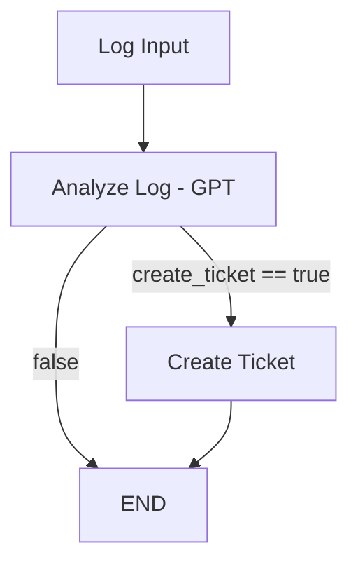

# 🧠 LangGraph Error Ticketing Agent

This project is a minimal agent built with [LangGraph](https://github.com/langchain-ai/langgraph).  
It analyzes log error messages using OpenAI's GPT and decides whether to create a ticket.

## 🔄 Flow Overview



## 🚀 Features

- Uses GPT (via LangChain) to extract structured info from raw logs
- Conditional routing in LangGraph
- Simulates or triggers real ticket creation (Jira-ready)
- Built in modular steps, ready to integrate with external tools like Jira or Datadog

## 🛠️ Setup Instructions

### 1. Clone the repo and set up your environment:

```bash
git clone https://github.com/your-username/langgraph-agent-demo.git
cd langgraph-agent-demo
python -m venv .venv
source .venv/bin/activate  # On Windows: .venv\Scripts\activate
pip install -r requirements.txt
```

### 2. Create a `.env` file and add your OpenAI key:

```
OPENAI_API_KEY=sk-...
```

### 3. Set your Python version (optional but recommended)

Create a `.python-version` file with the following content:

```
3.11.9
```

This ensures consistency across environments and tools like Pyenv or IDE integrations.

### 4. Run the agent

```bash
python main.py
```

You should see structured output based on the provided log input.

## 📦 Dependencies

Install them via `pip install -r requirements.txt`, or individually:

- `langgraph`
- `langchain`
- `langchain-openai`
- `openai`
- `python-dotenv`

## 📂 Project Structure

```
langgraph-agent-demo/
├── main.py                # Entrypoint: runs the LangGraph agent
├── .env                   # Configuration for API keys (not committed)
├── agent/
│   ├── datadog.py         # Log fetching and parsing logic
│   ├── graph.py           # Graph construction using LangGraph
│   ├── jira.py            # Jira API integration and deduplication
│   └── nodes.py           # Node logic: LLM analysis, ticket creation, etc.
└── README.md
```

## 💡 How it works (Detailed)

The agent follows a LangGraph-based state machine with memory.

- It pulls logs (from Datadog or another source)
- It checks if each log is a duplicate
- It sends the log message and metadata to an LLM
- If the response suggests creating a ticket, it checks Jira for duplicates
- If not found, it creates the ticket (simulated or real)

State is preserved across iterations, avoiding reprocessing.

## 🧱 Built With

- [LangChain](https://github.com/langchain-ai/langchain)
- [LangGraph](https://github.com/langchain-ai/langgraph)
- [OpenAI GPT](https://platform.openai.com/)

## ✅ Next Steps

This MVP can be extended with:

- Real Jira integration
- Error classification by severity
- Memory and context chaining
- Loading logs dynamically (e.g. from Datadog, S3, or filesystem)

---
MIT Licensed · Built with ❤️ by Juan + LangGraph