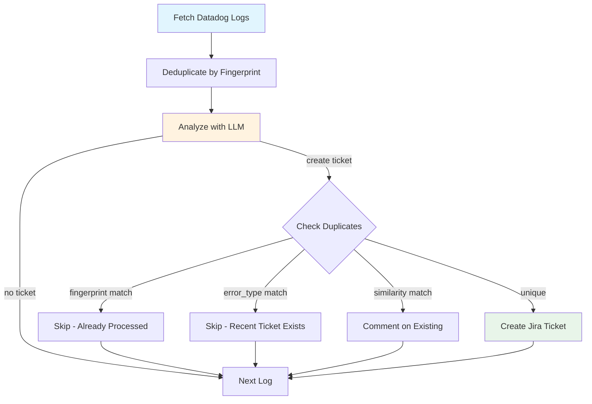

# Dogcatcher Agent

Automated agent that reads **Datadog error logs**, analyzes them with an **LLM**, performs **smart de-duplication** against Jira, and creates tickets. Includes **async parallel processing** (31k+ logs/hour), **Sleuth** for error investigation, and **Patchy** for self-healing PRs.

---

## Quick Start

```bash
# 1. Install dependencies
python -m venv .venv && source .venv/bin/activate
pip install -r requirements.txt

# 2. Configure .env (copy from .env.example)
cp .env.example .env
# Edit .env with your API keys

# 3. Verify connections
python main.py --check

# 4. Run in dry-run mode (safe)
python main.py --dry-run --service myservice --hours 24

# 5. Run in async mode (faster)
python main.py --dry-run --async --workers 5 --service myservice --hours 24
```

---

## End-to-end Flow



---

## Key Features

### Core Agent
- **Datadog ingestion** with configurable service/env/time window
- **LLM analysis** (gpt-4.1-nano) for error classification and ticket content
- **Multi-layer deduplication**: fingerprint cache, error_type labels, similarity matching
- **Configurable ticket cap** via `MAX_TICKETS_PER_RUN` (default: 3)

### Async Processing (Phase 2.1)
- **31,000+ logs/hour** throughput (vs ~150 in sync mode)
- Parallel workers with rate limiting
- Circuit breaker protection for API failures
- Fallback analysis when LLM unavailable

### Sleuth Agent
- **Natural language** error investigation
- Correlates logs with existing Jira tickets
- **Root cause analysis** via LLM
- **`--consolidate`** command to merge duplicate tickets

### Patchy Bot
- **Self-healing PRs** for known error patterns
- Integrates with Sleuth for automatic fixes
- Draft PR workflow with guardrails

---

## Commands

### Health Check
Verify all service connections before running:
```bash
python main.py --check
```
Output:
```
🔍 Running health checks...
  Checking OpenAI API... ✓ Connected (model: gpt-4.1-nano)
  Checking Datadog API... ✓ Connected (site: datadoghq.eu)
  Checking Jira API... ✓ Connected (your-domain.atlassian.net)
✅ All services ready!
```

### Dogcatcher (Main Agent)

```bash
# Dry-run (simulation, no tickets created)
python main.py --dry-run --service myservice --hours 24

# Real mode (creates tickets)
python main.py --real --service myservice --hours 24 --max-tickets 3

# Async mode (parallel processing)
python main.py --dry-run --async --workers 5 --service myservice --hours 24

# With configuration profile
python main.py --profile production --async --workers 10
```

**CLI Arguments:**
| Argument | Description |
|----------|-------------|
| `--check` | Verify OpenAI, Datadog, Jira connections and exit |
| `--dry-run` | Simulation mode (no tickets created) |
| `--real` | Real mode (creates tickets) |
| `--async` | Enable parallel processing |
| `--workers N` | Number of parallel workers (default: 5) |
| `--profile` | Configuration profile (development/staging/production/testing) |
| `--service` | Datadog service filter |
| `--env` | Datadog environment filter |
| `--hours N` | Time window in hours |
| `--limit N` | Max logs per page |
| `--max-tickets N` | Per-run ticket cap (0 = no limit) |
| `--team` | Process a single team in multi-tenant mode |

### Sleuth (Error Investigator)

```bash
# Investigate an error
python -m sleuth "duplicate entry in license table" --service myservice --hours 48

# Preview duplicate consolidation
python -m sleuth "duplicate entry" --service myservice --consolidate --dry-run

# Execute consolidation (closes duplicates, links to primary)
python -m sleuth "duplicate entry" --service myservice --consolidate

# With Patchy integration
python -m sleuth "NullPointerException in UserService" --invoke-patchy
```

**Sleuth Output:**
```
Investigating: "duplicate entry in license table"
Generated query: service:myservice env:prod status:error "duplicate" "entry"

Logs found: 22

Summary:
  Multiple duplicate key violations during license creation...

Probable root cause:
  Race condition in LicenseAuditListener causing concurrent inserts.

Related tickets:
  - DDSIT-151: Resolve Duplicate License Entry (Score: 1.00)
  - DDSIT-158: Resolve Duplicate Entry for License Primary Key (Score: 0.95)

Suggested fix:
  Add @Transactional with proper isolation level...
```

### Patchy (Self-Healing PRs)

```bash
export GITHUB_TOKEN=ghp_xxx

python -m patchy.patchy_graph \
  --service myservice \
  --error-type npe \
  --loghash 4c452e2d1c49 \
  --draft true
```

---

## Configuration

### Environment Variables (.env)

```ini
# OpenAI
OPENAI_API_KEY=sk-...
OPENAI_MODEL=gpt-4.1-nano
OPENAI_TEMPERATURE=0

# Datadog
DATADOG_API_KEY=...
DATADOG_APP_KEY=...
DATADOG_SITE=datadoghq.eu
DATADOG_SERVICE=myservice
DATADOG_ENV=prod
DATADOG_HOURS_BACK=48
DATADOG_LIMIT=50

# Jira
JIRA_DOMAIN=company.atlassian.net
JIRA_USER=you@company.com
JIRA_API_TOKEN=...
JIRA_PROJECT_KEY=PROJ

# Agent Behavior
AUTO_CREATE_TICKET=false
MAX_TICKETS_PER_RUN=3
COMMENT_ON_DUPLICATE=true

# Async Processing
ASYNC_ENABLED=false
ASYNC_MAX_WORKERS=5
ASYNC_RATE_LIMITING=true

# Circuit Breaker
CIRCUIT_BREAKER_ENABLED=true
CIRCUIT_BREAKER_FAILURE_THRESHOLD=5
CIRCUIT_BREAKER_TIMEOUT_SECONDS=60
FALLBACK_ANALYSIS_ENABLED=true
```

### Configuration Profiles

Pre-configured profiles in `config/profiles/*.yaml`:

| Profile | Description |
|---------|-------------|
| `development` | Safe defaults, no tickets, DEBUG logging |
| `staging` | Limited tickets, INFO logging |
| `production` | Auto-create, Redis cache, WARNING logging |
| `testing` | Minimal limits, memory cache |

```bash
python main.py --profile production --async
```

**Precedence:** `.env` → Profile YAML → Environment Variables → CLI Arguments

### Multi-Tenant Mode

When `config/teams.yaml` exists, the agent runs in **multi-tenant mode**: it loops through every team sequentially, each with its own Jira project, Datadog service filters, cache directory, and audit log.

**Setup:**
```bash
cp config/teams.yaml.example config/teams.yaml
# Edit config/teams.yaml with your teams

# Validate configuration
python -m tools.validate_teams
```

**Usage:**
```bash
# Process all teams
python main.py --profile production

# Process a single team
python main.py --profile production --team team-vega

# Dry-run a single team
python main.py --dry-run --team team-vega
```

**Per-team isolation:**
- Cache: `.agent_cache/teams/{team_id}/`
- Audit logs: `.agent_cache/teams/{team_id}/audit_logs.jsonl`
- Each team has its own Jira project key and Datadog service filters

**Validation tool:**
```bash
python -m tools.validate_teams                              # validate default path
python -m tools.validate_teams config/teams.yaml.example    # validate specific file
python -m tools.validate_teams --schema                     # emit JSON Schema
python -m tools.validate_teams --schema -o schema/teams.schema.json
```

> **Backward compatible:** Without `teams.yaml`, the agent runs in single-tenant mode with no behavior changes.

---

## Duplicate Detection

The agent uses a multi-layer approach to prevent duplicate tickets:

### 1. Fingerprint Cache (Fastest)
```python
fingerprint = sha1(f"{error_type}|{normalized_message}")[:12]
```
- Uses **error_type** (from LLM) instead of logger name
- Same error from different loggers = same fingerprint
- Persisted in `.agent_cache/processed_logs.json`

### 2. Error Type Label Search
Before creating a ticket, searches Jira:
```
project = PROJ AND labels = datadog-log AND labels = {error_type} AND created >= -7d
```
Prevents duplicates across runs when fingerprint cache is cleared.

### 3. Similarity Matching
- **Direct log match**: Compare normalized log with ticket's "Original Log" (threshold: 0.90)
- **Title + description similarity**: Weighted scoring with boosts (threshold: 0.82)
- On match: optionally auto-comment with new context

### 4. Loghash Labels
Tickets get `loghash-{fingerprint}` label for O(1) future lookups.

---

## Async Processing

Enable with `--async` flag for 200x throughput improvement:

```bash
python main.py --async --workers 5 --service myservice --hours 24
```

**Architecture:**
- True async with `asyncio` and `httpx`
- Semaphore-based concurrency control
- Rate limiting to avoid API throttling
- Circuit breaker for resilience

**Performance:**
| Mode | Throughput | Use Case |
|------|------------|----------|
| Sync | ~150 logs/hour | Debugging, small batches |
| Async (5 workers) | ~31,000 logs/hour | Production workloads |

---

## Project Structure

```
dogcatcher-agent/
├── main.py                    # CLI entrypoint
├── agent/
│   ├── config.py              # Pydantic configuration
│   ├── graph.py               # LangGraph pipeline
│   ├── async_processor.py     # Parallel processing
│   ├── healthcheck.py         # Service connectivity checks
│   ├── team_config.py         # Multi-tenant Pydantic models
│   ├── team_loader.py         # Teams YAML loader with caching
│   ├── datadog.py             # Datadog client (sync)
│   ├── datadog_async.py       # Datadog client (async)
│   ├── nodes/
│   │   ├── analysis.py        # LLM analysis (sync)
│   │   ├── analysis_async.py  # LLM analysis (async)
│   │   ├── ticket.py          # Ticket creation (sync)
│   │   └── ticket_async.py    # Ticket creation (async)
│   ├── jira/
│   │   ├── client.py          # Jira REST client
│   │   ├── async_client.py    # Async Jira client
│   │   ├── match.py           # Similarity matching
│   │   └── utils.py           # Normalization, fingerprints
│   └── utils/
│       ├── circuit_breaker.py # Resilience patterns
│       └── fallback_analysis.py
├── sleuth/
│   ├── sleuth_graph.py        # Sleuth CLI & graph
│   └── sleuth_nodes.py        # Investigation nodes
├── patchy/
│   └── patchy_graph.py        # Self-healing PR bot
├── config/
│   ├── profiles/              # YAML configuration profiles
│   └── teams.yaml.example     # Multi-tenant config example
├── tools/
│   ├── report.py              # Audit report generator
│   └── validate_teams.py      # Teams config validator
└── tests/
    ├── unit/
    └── integration/
```

---

## Docker

### Build & Run
```bash
docker build -t dogcatcher-agent:latest .

# Dry-run
docker run --rm --env-file .env \
  -v $(pwd)/.agent_cache:/app/.agent_cache \
  dogcatcher-agent:latest \
  python main.py --dry-run --async --service myservice

# With docker-compose
docker compose up --build
```

---

## Reporting

Generate audit summaries from `.agent_cache/audit_logs.jsonl`:

```bash
python tools/report.py --since-hours 24
```

Output:
```
=== Audit Summary ===
Total decisions: 300
Tickets created: 2
Duplicates detected: 286
  - By fingerprint: 250
  - By error_type: 20
  - By similarity: 16
Errors: 0
```

---

## Troubleshooting

| Issue | Solution |
|-------|----------|
| `--check` fails | Verify API keys in `.env` |
| 410 Gone from Jira | Update agent (uses new `/search/jql` endpoint) |
| No tickets created | Check fingerprint cache, run with `--dry-run` first |
| Duplicate tickets | Run Sleuth with `--consolidate` to merge |
| Slow processing | Use `--async --workers 5` |
| LLM errors | Circuit breaker will use fallback analysis |

---

## Development

```bash
# Run tests
python run_tests.py              # All tests
python run_tests.py unit         # Unit tests only

# Format code
black .

# Type checking
mypy .
```

---

MIT License · Built with LangGraph
