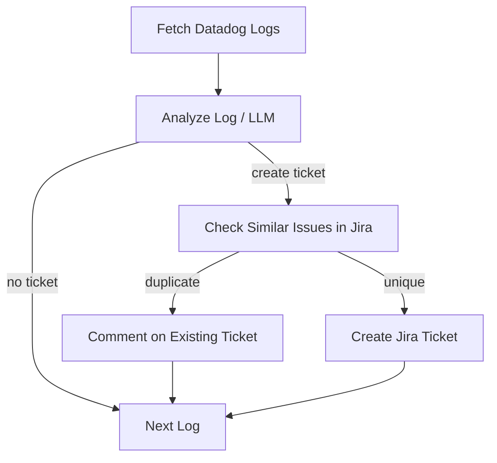

# 🧠 Datadog → LLM → Jira Agent (LangGraph)

Automated agent that reads **Datadog error logs**, analyzes them with an **LLM** (LangChain + OpenAI), performs **smart de‑duplication** against Jira, and **creates at most three tickets per run** with rich context.

---

## 🔄 End‑to‑end Flow


---

## 🚀 Key Features
- **Datadog ingestion** (service/env/time window) with `logger`, `thread`, `timestamp`, `detail`.
- **LLM analysis (gpt‑4o‑mini)** → `error_type`, `severity (low|medium|high)`, `ticket_title`, `ticket_description` (markdown: *Problem summary*, *Possible Causes*, *Suggested Actions*).
- **Ticket guard**: creates **up to 3** real Jira tickets per execution.
- **Idempotence & de‑dup**
  - In‑run: skip duplicated logs by `logger|thread|message`.
  - Cross‑run: fingerprint (`sha1`) cached in `.agent_cache/processed_logs.json`.
  - Jira short‑circuit via `labels = loghash-<sha1(normalized message)[:12]>`.
- **Advanced Jira duplicate detection**
  - **Direct log match first**: compare the **normalized current log** with the ticket’s **Original Log** (extracted from description). If similarity ≥ **0.90** → duplicate immediately.
  - Otherwise, similarity by **title + description** with boosts (error_type, logger, token overlap). Window **365d**, filtering `statusCategory != Done` and `labels = datadog-log`.
  - When a duplicate is detected, optionally **auto‑comment** with new context and **retro‑seed** the `loghash-…` label on the existing issue.
- **Ticket formatting**
  - Summary: **`[Datadog][<error_type>] <title>`** (title auto‑truncated to 120 chars)
  - Labels: **`datadog-log`** (+ `loghash-…` where applicable)
  - Description includes **Original Log**, logger/thread/timestamp, detail, and **occurrence count** within the window.
- **Noise‑aware context**
  - The agent aggregates **occurrence counts** per fingerprint and shows: `Occurrences in last <hours>h: <N>` in descriptions and duplicate comments.

---

## 🧰 Requirements
- Python **3.11**.
- Install deps:
```bash
python -m venv .venv && source .venv/bin/activate
pip install -r requirements.txt
```
*(Optional) `rapidfuzz` improves matching — already listed in `requirements.txt`.*

---

## ⚙️ Configuration (.env)
```ini
# OpenAI
OPENAI_API_KEY=sk-...

# Datadog
DATADOG_API_KEY=...
DATADOG_APP_KEY=...
DATADOG_SITE=datadoghq.eu  # or datadoghq.com
DATADOG_SERVICE=dehnproject
DATADOG_ENV=dev             # dev|prod
DATADOG_HOURS_BACK=48       # time window
DATADOG_LIMIT=50            # page size
DATADOG_MAX_PAGES=3         # pagination safeguard
DATADOG_TIMEOUT=20          # seconds
DATADOG_STATUSES=error,critical
DATADOG_QUERY_EXTRA=        # e.g. @message:"Blob Not Found"
DATADOG_QUERY_EXTRA_MODE=AND  # AND|OR for DATADOG_QUERY_EXTRA terms

# Jira
JIRA_DOMAIN=your-domain.atlassian.net
JIRA_USER=you@company.com
JIRA_API_TOKEN=...
JIRA_PROJECT_KEY=DPRO

# Agent behavior
AUTO_CREATE_TICKET=false     # true/1/yes => real creation
PERSIST_SIM_FP=false         # persist fingerprints in simulation
COMMENT_ON_DUPLICATE=true    # comment on matched issue
```

Notes:
- The agent prints the **exact Datadog query** for transparency.
- If a query with `DATADOG_QUERY_EXTRA` yields 0 results, it will **retry once without** the extra clause and report findings to help tuning.

---

## ▶️ Run
```bash
python main.py
```
- **Early exit** if no logs are available in the selected window.
- **Simulation** (`AUTO_CREATE_TICKET=false`): analyzes logs and simulates ticket creation.
- **Real** (`AUTO_CREATE_TICKET=true`): creates **up to 3** real tickets per run; on duplicates it comments and does not create.

You can also run with CLI arguments:
```bash
python main.py --dry-run --env dev --service dehnproject --hours 24 --limit 50
```

- `--dry-run`: run in simulation mode without creating Jira tickets.
- `--real`: (alternative to --dry-run) run in real mode and create tickets.
- `--env`: Datadog environment to query (`dev` or `prod`).
- `--service`: Datadog service name to filter logs.
- `--hours`: time window in hours for logs to fetch.
- `--limit`: maximum logs per page from Datadog.

---

## 🧪 Duplicate Matching — Details
1. **Fingerprints**: skip if `logger|thread|message` seen in current run; persist across runs in `.agent_cache/processed_logs.json`.
2. **Exact log match**: normalize current log and compare to issue’s **Original Log** (from description). If similarity ≥ **0.90**, return that issue.
3. **Similarity scoring**: `0.6*title_sim + 0.3*desc_sim` with boosts (`+0.10` error_type, `+0.05` logger, `+0.05` token overlap). Threshold **0.82**.
4. **Labels**: on duplicate, add `loghash-<…>` to the existing issue to enable O(1) future matches by label.

Normalization removes email addresses, URLs/tokens, UUIDs, timestamps, long hashes, and collapses whitespace to make matches robust.

---

## 📦 Project Structure
```
langgraph-agent-demo/
├── main.py                # Entrypoint
├── .env                   # Secrets & config
├── agent/
│   ├── datadog.py         # Fetch & parse logs
│   ├── graph.py           # LangGraph wiring
│   ├── state.py           # Shared state types
│   ├── jira.py            # Jira API + matching + commenting
│   └── nodes.py           # LLM analysis + ticket creation + guards
└── requirements.txt
```

---

## 🛠️ Troubleshooting
- No real ticket created → likely a fingerprint or a duplicate (the console prints the reason and any similarity score).
- 0 results from Datadog with `DATADOG_QUERY_EXTRA` → check the printed query; the agent will probe without extra and report.
- Jira 401/403 → verify domain/user/token and project permissions.
- Recursion guard → `recursion_limit` is raised to handle longer runs; ensure your environment matches `main.py`.

---

MIT · Built by Juan ⚡️