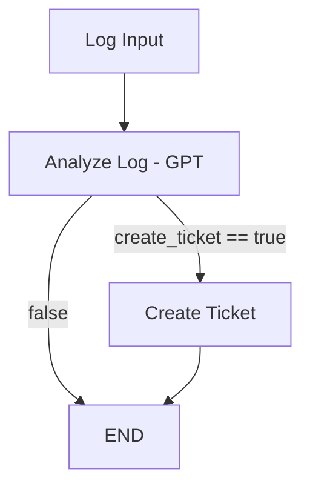

# 🧠 LangGraph Error Ticketing Agent

This project is a minimal agent built with [LangGraph](https://github.com/langchain-ai/langgraph).  
It analyzes log error messages using OpenAI's GPT and decides whether to create a ticket.

## 🔄 Flow Overview



## 🚀 Features

- Uses GPT (via LangChain) to extract structured info from raw logs
- Conditional routing in LangGraph
- Simulates or triggers real ticket creation (Jira-ready)
- Built in modular steps, ready to integrate with external tools like Jira or Datadog

## 🛠️ Setup Instructions

### 1. Clone the repo and set up your environment:

```bash
git clone https://github.com/your-username/langgraph-agent-demo.git
cd langgraph-agent-demo
python -m venv .venv
source .venv/bin/activate  # On Windows: .venv\Scripts\activate
pip install -r requirements.txt
```

### 2. Create a `.env` file and add your OpenAI key:

```
OPENAI_API_KEY=sk-...
```

### 3. Set your Python version (optional but recommended)

Create a `.python-version` file with the following content:

```
3.11.9
```

This ensures consistency across environments and tools like Pyenv or IDE integrations.

### 4. Run the agent

```bash
python main.py
```

You should see structured output based on the provided log input.

## 📦 Dependencies

Install them via `pip install -r requirements.txt`, or individually:

- `langgraph`
- `langchain`
- `langchain-openai`
- `openai`
- `python-dotenv`

## 📂 Project Structure

```
langgraph-agent-demo/
├── main.py                # Entrypoint: runs the LangGraph agent
├── .env                   # Configuration for API keys (not committed)
├── agent/
│   ├── datadog.py         # Log fetching and parsing logic
│   ├── graph.py           # Graph construction using LangGraph
│   ├── jira.py            # Jira API integration and deduplication
│   └── nodes.py           # Node logic: LLM analysis, ticket creation, etc.
└── README.md
```

## 💡 How it works (Detailed)

The agent follows a LangGraph-based state machine with memory.

- It pulls logs (from Datadog or another source)
- It checks if each log is a duplicate
- It sends the log message and metadata to an LLM
- If the response suggests creating a ticket, it checks Jira for duplicates
- If not found, it creates the ticket (simulated or real)

State is preserved across iterations, avoiding reprocessing.

## 🧱 Built With

- [LangChain](https://github.com/langchain-ai/langchain)
- [LangGraph](https://github.com/langchain-ai/langgraph)
- [OpenAI GPT](https://platform.openai.com/)

## ✅ Next Steps

This MVP can be extended with:

- Real Jira integration
- Error classification by severity
- Memory and context chaining
- Loading logs dynamically (e.g. from Datadog, S3, or filesystem)

---
MIT Licensed · Built with ❤️ by Juan + LangGraph
# 🧠 Datadog → LLM → Jira Agent (LangGraph)

An automated agent that reads **Datadog error logs**, analyzes each entry with an **LLM** (LangChain + OpenAI), **deduplicates** against Jira using a smart matcher, and **creates** (or simulates) a **single ticket per run** in Jira with rich context.

---

## 🔄 End‑to‑end Flow
```mermaid
graph TD
    A[Fetch Datadog Logs] --> B[Analyze Log (LLM)]
    B -->|create_ticket=true| C[Advanced Duplicate Check in Jira]
    C -->|Duplicate| D[Comment on Existing Ticket]
    C -->|Unique| E[Create Jira Ticket]
    B -->|false| F[Skip]
    D --> G[Next Log]
    E --> G[Next Log]
    F --> G[Next Log]
```

---

## 🚀 Key Features
- **Datadog ingestion**: service/env/time window; includes logger/thread/timestamp/detail.
- **LLM analysis (gpt‑4o‑mini)** → `error_type`, `severity (low|medium|high)`, `ticket_title`, `ticket_description` (markdown with *Problem summary*, *Possible Causes*, *Suggested Actions*).
- **One‑ticket guard**: creates **at most one** Jira ticket per execution.
- **Idempotence**:
  - In‑run dedupe: unique key `logger|thread|message`.
  - Cross‑run dedupe: **fingerprint** (`sha1`) persisted in `.agent_cache/processed_logs.json`.
- **Advanced Jira duplicate detection** (summary + description, token normalization, optional RapidFuzz; boosts by `error_type` and `logger`).
- **Comment on duplicate**: optional auto‑comment on the matched Jira issue with new log context.
- **Consistent formatting**:
  - Summary prefix: **`[Datadog][<error_type>] <title>`**
  - Labels: exactly **`datadog-log`**
  - Priority from severity: `low→Low`, `medium→Medium`, `high→High`

---

## 🧰 Requirements
- Python **3.11** (suggested).
- Install deps:
```bash
python -m venv .venv && source .venv/bin/activate
pip install -r requirements.txt
```
*Optional:* `rapidfuzz` is already listed; improves duplicate matching. If not installed, the agent falls back to `difflib`.

---

## ⚙️ Configuration (.env)
Create a `.env` in the project root:

### OpenAI
```
OPENAI_API_KEY=sk-...
```

### Datadog
```
DATADOG_API_KEY=...
DATADOG_APP_KEY=...
DATADOG_SITE=datadoghq.eu   # or datadoghq.com, etc.
```

### Jira
```
JIRA_DOMAIN=your-domain.atlassian.net
JIRA_USER=you@company.com
JIRA_API_TOKEN=...
JIRA_PROJECT_KEY=DPRO
```

### Agent behavior
```
# Create real tickets? (otherwise simulate)
AUTO_CREATE_TICKET=false   # true/1/yes to enable

# Persist fingerprints when simulating (to block future duplicates)
PERSIST_SIM_FP=false       # default false; set true if you want simulations to count

# On duplicate match, add a comment to the existing ticket
COMMENT_ON_DUPLICATE=true  # true by default
```

---

## ▶️ Run
```bash
python main.py
```
**Simulation mode** (`AUTO_CREATE_TICKET=false`): analiza logs y “crea” 1 ticket simulado.

**Real mode** (`AUTO_CREATE_TICKET=true`): crea **1 ticket real** como máximo por run. Si hay duplicado, no crea y (opcionalmente) comenta en el existente.

---

## 🧪 How Duplicate Detection Works
1. **Advanced search in Jira** (last 180d, `statusCategory != Done`) over **summary** and **description** plus `labels = datadog-log`.
2. **Normalize** terms (`prePersist ≈ pre-persist ≈ pre persist`, lowercase, remove punctuation).
3. **Score**: `0.6*title_sim + 0.3*desc_sim + boosts`  
   Boosts: `+0.10` if `error_type` matches; `+0.05` if `logger` appears; `+0.05` if tokens overlap.  
   Threshold: **0.82**.
4. **If duplicate**: no creamos ticket. Si `COMMENT_ON_DUPLICATE=true`, publicamos un comentario con timestamp/logger/thread/mensaje original.

> Nota: Además, si el `fingerprint` (sha1 de `logger|thread|message`) ya fue procesado en runs previos, se salta antes de consultar Jira.

---

## 🏷️ Ticket Format (Jira)
- **Summary**: `[Datadog][<error_type>] <short title>`
- **Labels**: `datadog-log`
- **Priority**: `Low | Medium | High` (según `severity` del LLM)
- **Description**: markdown con secciones y datos del log: timestamp, logger, thread, original message y detail (truncado a 300 chars).

---

## 🛡️ Safety & Operations
- **One‑ticket per run**: guardarraíl para evitar spam en producción.
- **Idempotence cache**: `.agent_cache/processed_logs.json`.  
  Si quieres “forzar” una nueva creación sobre el mismo log, borra el archivo o cambia el contenido del mensaje.

---

## 🔧 Troubleshooting
- **No se crea ticket en real**: mira si el log cae por fingerprint ya procesado o por match de duplicado (verás el *score* en consola).
- **Warning `response_format`**: ya mitigado usando `model_kwargs`.
- **Sin `rapidfuzz`**: el agente funciona igual con `difflib`, pero con menor precisión.
- **403/401 de Jira**: revisa `JIRA_DOMAIN`, `JIRA_USER`, `JIRA_API_TOKEN` y permisos de proyecto.

---

## 📦 Project Structure
```
langgraph-agent-demo/
├── main.py                # Entrypoint
├── .env                   # Secrets & config
├── agent/
│   ├── datadog.py         # Fetch & parse logs
│   ├── graph.py           # LangGraph wiring
│   ├── jira.py            # Jira API + matching + commenting
│   └── nodes.py           # LLM analysis + ticket creation + guards
└── requirements.txt
```

---

## 🗺️ Roadmap (nice to have)
- Link directo al log en Datadog dentro del ticket/comentario.
- Relación automática “Duplicates” en Jira (issue link) además del comentario.
- Reglas heurísticas de severidad como fallback al LLM.
- Batch con backoff para grandes volúmenes de logs.

---
MIT · Built by Juan ⚡️