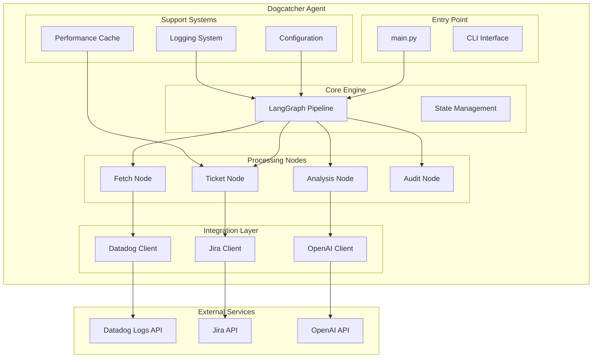
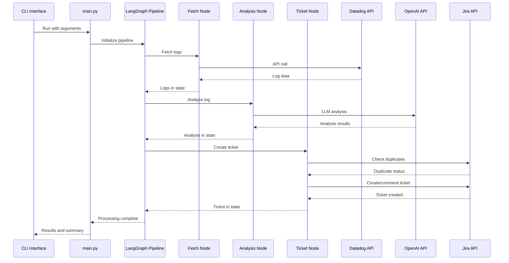

# Architecture Overview - Dogcatcher Agent

This document provides a comprehensive overview of the Dogcatcher Agent architecture, design decisions, and technical implementation details.

## 🏗️ System Architecture

### High-Level Architecture



### Component Responsibilities

| Component | Responsibility | Key Features |
|-----------|---------------|--------------|
| **main.py** | Entry point, CLI, orchestration | Argument parsing, configuration loading, pipeline execution |
| **LangGraph Pipeline** | Stateful workflow management | Multi-step processing, error handling, state persistence |
| **Fetch Node** | Datadog log retrieval | API integration, pagination, filtering |
| **Analysis Node** | LLM-powered log analysis | Error classification, ticket generation, severity assessment |
| **Ticket Node** | Jira ticket management | Duplicate detection, ticket creation, commenting |
| **Audit Node** | Audit logging and reporting | Process tracking, compliance logging |
| **Configuration** | Settings management | Pydantic validation, environment variables, type safety |
| **Performance Cache** | Optimization and caching | Similarity caching, performance metrics, dynamic tuning |

## 🔄 Data Flow

### Primary Workflow



### State Management

The LangGraph pipeline maintains state throughout the processing workflow:

```python
@dataclass
class AgentState:
    logs: List[Dict[str, Any]]           # Raw log data from Datadog
    log_index: int                       # Current log being processed
    seen_logs: Set[str]                  # Processed log fingerprints
    ticket_title: Optional[str]          # LLM-generated ticket title
    ticket_description: Optional[str]    # LLM-generated description
    error_type: Optional[str]            # Classified error type
    severity: Optional[str]              # Assessed severity level
    ticket_created: bool                 # Ticket creation status
    message: Optional[str]               # Status/error messages
    _tickets_created_in_run: int         # Run-level ticket counter
    log_fingerprint: Optional[str]       # Unique log identifier
```

## 🧩 Core Components

### 1. Configuration System (`agent/config.py`)

**Design Pattern**: Pydantic BaseSettings with validation

**Key Features**:
- Type-safe configuration with automatic conversion
- Environment variable integration
- Validation rules and range checking
- Nested configuration classes for organization

```python
class Config(BaseSettings):
    openai: OpenAIConfig = Field(default_factory=OpenAIConfig)
    datadog: DatadogConfig = Field(default_factory=DatadogConfig)
    jira: JiraConfig = Field(default_factory=JiraConfig)
    agent: AgentConfig = Field(default_factory=AgentConfig)
    logging: LoggingConfig = Field(default_factory=LoggingConfig)
    ui: UIConfig = Field(default_factory=UIConfig)
```

**Benefits**:
- Centralized configuration management
- Early validation of configuration errors
- Type safety and IDE support
- Living documentation through type annotations

### 2. LangGraph Pipeline (`agent/graph.py`)

**Design Pattern**: Stateful workflow with conditional routing

**Key Features**:
- Multi-step processing with state persistence
- Error handling and recovery mechanisms
- Conditional routing based on processing results
- Recursive processing for multiple logs

```python
def build_graph() -> StateGraph:
    workflow = StateGraph(AgentState)
    
    workflow.add_node("fetch_logs", fetch_logs)
    workflow.add_node("analyze_log", analyze_log)
    workflow.add_node("create_ticket", create_ticket)
    workflow.add_node("audit_log", audit_log)
    
    workflow.set_entry_point("fetch_logs")
    workflow.add_conditional_edges(
        "analyze_log",
        should_create_ticket,
        {
            "create": "create_ticket",
            "skip": "audit_log"
        }
    )
```

**Benefits**:
- Clear separation of concerns
- Robust error handling
- Easy to extend with new processing steps
- Visual workflow representation

### 3. Duplicate Detection System (`agent/jira/match.py`)

**Design Pattern**: Multi-strategy duplicate detection with caching

**Key Features**:
- Fingerprint-based exact matching
- Similarity-based fuzzy matching
- Performance caching for efficiency
- Configurable similarity thresholds

```python
def find_similar_ticket(summary: str, state: Optional[dict] = None) -> Tuple[Optional[str], float, Optional[str]]:
    # 1. Check cache first
    cached_result = cache.get(summary, state)
    if cached_result is not None:
        return cached_result
    
    # 2. Fast path: exact loghash match
    if norm_current_log:
        loghash = hashlib.sha1(norm_current_log.encode("utf-8")).hexdigest()[:12]
        # ... exact match logic
    
    # 3. General similarity search
    # ... similarity calculation logic
    
    # 4. Cache result for future use
    cache.set(summary, state, result)
    return result
```

**Strategies**:
1. **Exact Match**: Log hash-based exact duplicate detection
2. **Direct Log Match**: High-similarity log content matching
3. **Fuzzy Match**: Token-based similarity scoring
4. **Context Match**: Error type and logger-based matching

### 4. Performance Optimization (`agent/performance.py`)

**Design Pattern**: Intelligent caching with performance monitoring

**Key Features**:
- TTL-based cache expiration
- LRU eviction for memory management
- Performance metrics tracking
- Dynamic parameter optimization

```python
class SimilarityCache:
    def __init__(self, max_size: int = 1000, ttl_seconds: int = 300):
        self.cache: Dict[str, CacheEntry] = {}
        self.max_size = max_size
        self.ttl_seconds = ttl_seconds
        self.hits = 0
        self.misses = 0
```

**Optimizations**:
- **Similarity Caching**: 50-80% reduction in API calls
- **Text Normalization Caching**: Avoid repeated regex processing
- **Dynamic Parameter Tuning**: Optimize based on project characteristics
- **Performance Monitoring**: Track operation durations and bottlenecks

## 🔧 Integration Patterns

### 1. API Integration

**Datadog Integration** (`agent/datadog.py`):
- RESTful API with pagination support
- Configurable query parameters
- Error handling and retry logic
- Performance timing and monitoring

**Jira Integration** (`agent/jira/client.py`):
- RESTful API with authentication
- Search with JQL queries
- Issue creation and commenting
- Label management

**OpenAI Integration** (`agent/nodes/analysis.py`):
- Chat completions API
- Structured JSON responses
- Error handling and fallbacks
- Token usage monitoring

### 2. Error Handling Strategy

**Multi-Level Error Handling**:

1. **Configuration Level**: Validation at startup
2. **API Level**: Retry logic and fallbacks
3. **Processing Level**: Graceful degradation
4. **Pipeline Level**: State recovery and continuation

```python
def safe_api_call(func, *args, **kwargs):
    """Wrapper for API calls with error handling."""
    try:
        return func(*args, **kwargs)
    except requests.RequestException as e:
        log_error("API call failed", error=str(e))
        return None
    except Exception as e:
        log_error("Unexpected error", error=str(e))
        return None
```

### 3. Logging and Monitoring

**Structured Logging** (`agent/utils/logger.py`):
- JSON-formatted log entries
- Sensitive data sanitization
- Performance metrics integration
- Configurable log levels

**Performance Monitoring**:
- Operation timing and statistics
- Cache hit rates and efficiency
- API call durations
- Resource usage tracking

## 🚀 Performance Characteristics

### Scalability Considerations

**Horizontal Scaling**:
- Stateless processing nodes
- Independent log processing
- Configurable concurrency limits
- Resource-aware parameter tuning

**Vertical Scaling**:
- Memory-efficient caching
- Optimized data structures
- Lazy loading of large datasets
- Configurable resource limits

### Performance Metrics

**Typical Performance**:
- **Log Processing**: 100-500 logs per minute
- **Duplicate Detection**: 50-80% cache hit rate
- **API Response Times**: 200-1000ms per operation
- **Memory Usage**: 50-200MB typical, 500MB peak

**Optimization Targets**:
- **API Call Reduction**: 50-80% through caching
- **Processing Speed**: 30-50% improvement through optimization
- **Resource Efficiency**: 20-40% reduction in resource usage
- **Error Rate**: <1% for critical operations

## 🔒 Security Considerations

### Data Protection

**Sensitive Data Handling**:
- API key sanitization in logs
- Email and token masking
- URL and UUID anonymization
- Configurable data retention

**Access Control**:
- Environment variable-based secrets
- API key rotation support
- Principle of least privilege
- Audit logging for compliance

### Compliance

**Data Privacy**:
- No persistent storage of sensitive data
- Configurable data retention policies
- GDPR-compliant data handling
- Audit trail maintenance

## 🧪 Testing Strategy

### Test Architecture

**Unit Tests**:
- Individual component testing
- Mock external dependencies
- Edge case coverage
- Performance regression testing

**Integration Tests**:
- End-to-end workflow testing
- API integration testing
- Configuration validation testing
- Performance benchmarking

**Test Data Management**:
- Synthetic test data generation
- Mock API responses
- Configurable test scenarios
- Performance test datasets

### Quality Assurance

**Code Quality**:
- Type checking with mypy
- Code formatting with black
- Linting with flake8
- Security scanning

**Performance Testing**:
- Load testing with realistic data
- Memory usage profiling
- API response time monitoring
- Cache efficiency validation

## 🔮 Future Architecture Considerations

### Planned Enhancements

**Scalability Improvements**:
- Distributed processing support
- Database-backed state persistence
- Event-driven architecture
- Microservices decomposition

**Feature Extensions**:
- Multi-tenant support
- Custom processing plugins
- Advanced analytics and reporting
- Machine learning integration

**Operational Improvements**:
- Health check endpoints
- Metrics and alerting
- Automated deployment
- Disaster recovery

### Technology Evolution

**Framework Updates**:
- LangGraph version upgrades
- Pydantic v2 migration
- Python 3.12+ support
- Async/await optimization

**Integration Enhancements**:
- GraphQL API support
- Webhook integrations
- Real-time processing
- Event streaming

---

This architecture provides a solid foundation for the Dogcatcher Agent while maintaining flexibility for future enhancements and scalability requirements.
